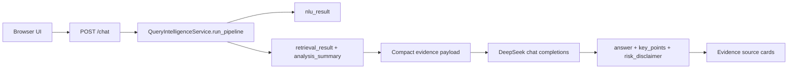
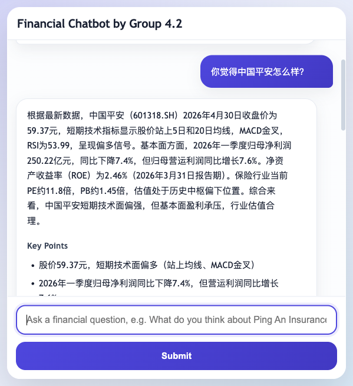
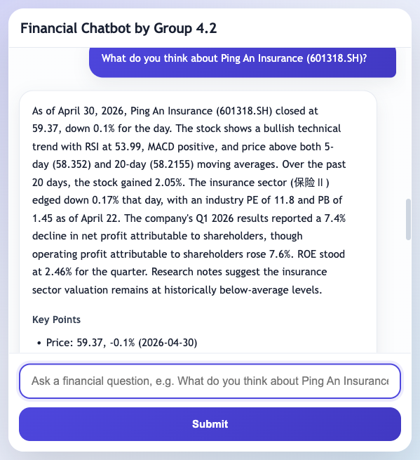

# Local Frontend Chatbot

Languages: English | [中文](zh/frontend-chatbot.md)

The local frontend chatbot is the browser-facing demo for FinSight. It is intentionally thin: the UI sends a user question to `POST /chat`, the backend runs Query Intelligence, and DeepSeek only rewrites the compact evidence into a user-facing answer.

This wrapper must not replace the NLU/Retrieval backbone. Entity resolution, intent, source planning, evidence retrieval, ranking, warnings, and `analysis_summary` still come from Query Intelligence.

## Run

From a fresh clone:

```bash
pip install -r requirements.txt
export DEEPSEEK_API_KEY="your_deepseek_api_key_here"
python scripts/launch_chatbot.py
```

Then open:

```text
http://127.0.0.1:8765/
```

For repeatable local demos, you can disable slow announcement live calls while keeping local announcement seed data available:

```bash
QI_USE_LIVE_ANNOUNCEMENT=0 python scripts/launch_chatbot.py
```

## Request Flow



If DeepSeek is missing, unreachable, or returns invalid JSON, `/chat` returns a structured-summary fallback with `llm.status="fallback"`. It still includes `nlu_result`, `retrieval_result`, and evidence sources.

## DeepSeek Configuration

Defaults live in `config/app_config.json` and can be overridden by environment variables.

| Field | Env var | Default |
|---|---|---|
| `deepseek.api_key` | `DEEPSEEK_API_KEY` | empty |
| `deepseek.base_url` | `DEEPSEEK_BASE_URL` | `https://api.deepseek.com` |
| `deepseek.chat_path` | `DEEPSEEK_CHAT_PATH` | `/chat/completions` |
| `deepseek.model` | `DEEPSEEK_MODEL` | `deepseek-v4-flash` |
| `deepseek.timeout_seconds` | `DEEPSEEK_TIMEOUT_SECONDS` | `60` |
| `deepseek.thinking_type` | `DEEPSEEK_THINKING_TYPE` | `enabled` |
| `deepseek.reasoning_effort` | `DEEPSEEK_REASONING_EFFORT` | `high` |
| `deepseek.max_tokens` | `DEEPSEEK_MAX_TOKENS` | `8192` |

Use `DEEPSEEK_MODEL=deepseek-v4-pro` when you want the higher-capability model. Use `DEEPSEEK_REASONING_EFFORT=max` for heavier thinking. The backend sends `response_format={"type":"json_object"}` and prompts DeepSeek for one strict JSON object.

## API Contract

`POST /chat` accepts the same frontend context fields as the core pipeline:

```json
{
  "query": "你觉得中国平安怎么样？",
  "user_profile": {},
  "dialog_context": [],
  "top_k": 20,
  "debug": false
}
```

Response fields:

| Field | Meaning |
|---|---|
| `answer` | Final user-facing wording generated by DeepSeek or fallback summary. |
| `key_points` | Short bullet points grounded in retrieved evidence. |
| `risk_disclaimer` | Investment-risk disclaimer. |
| `evidence_used` | Evidence IDs selected by the answer layer. |
| `evidence_sources` | UI-ready source cards with title, type, source name, and optional URL. |
| `llm` | `{provider, model, status, error}` for model observability. |
| `nlu_result` | Full Query Intelligence NLU artifact. |
| `retrieval_result` | Full retrieval artifact, including warnings and `analysis_summary`. |

## Verified Local Run

The following screenshots came from real local browser runs on May 3, 2026. The service was started with `deepseek-v4-flash`, thinking enabled, `reasoning_effort=high`, and a local environment variable for the API key. The key is not written to the repository.

Chinese query:

```text
你觉得中国平安怎么样？
```



English query:

```text
What do you think about Ping An Insurance (601318.SH)?
```



Observed checks:

| Check | Result |
|---|---|
| `GET /health` | `{"status":"ok"}` |
| `POST /chat` Chinese query | `llm.status="ok"`, response in Chinese |
| `POST /chat` English query | `llm.status="ok"`, response in English |
| Browser interaction | Input, submit button, answer card, key points, evidence cards, and disclaimer rendered |
| Dependency issue fixed | Added `socksio` so `httpx` can use local SOCKS proxy variables |

## Troubleshooting

If DeepSeek falls back with a SOCKS proxy error, install dependencies again:

```bash
pip install -r requirements.txt
```

If live providers fail, inspect `retrieval_result.warnings`. The pipeline is expected to degrade gracefully and still answer from fallback providers or shipped runtime assets when possible.
